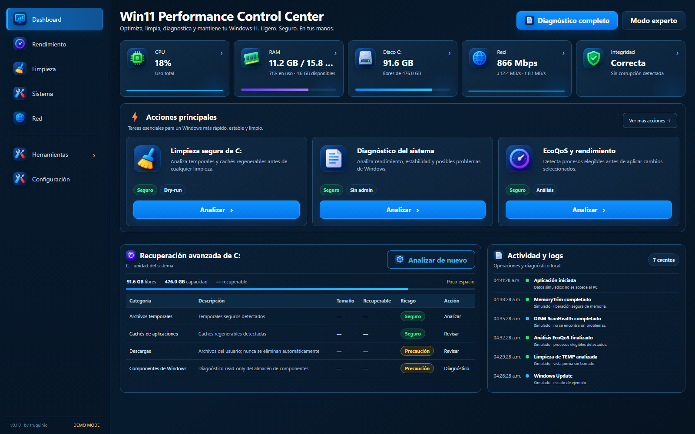
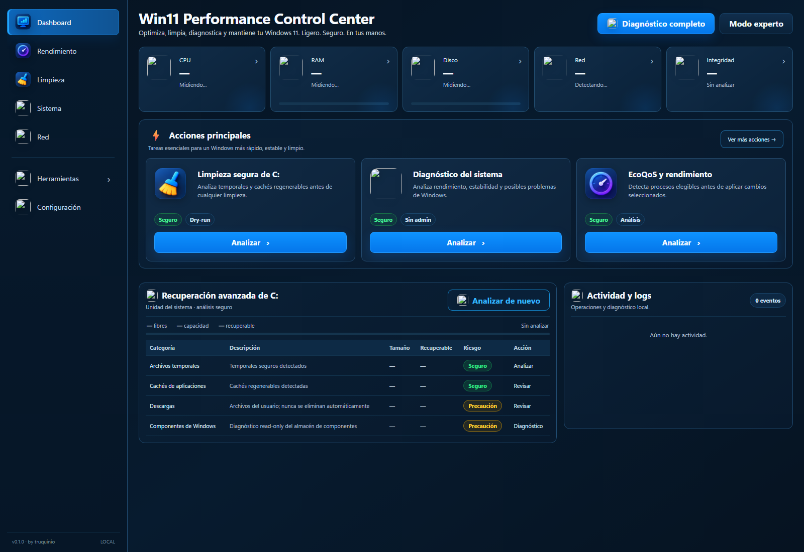

<p align="center">
  
</p>

<h1 align="center">Win11 Performance Control Center</h1>

<p align="center">
  Diagnóstico, mantenimiento seguro y optimización verificable para Windows 11.
  <br/>
  <strong>Offline-first · allowlisted actions · UAC puntual · rollback donde corresponde</strong>
</p>

<p align="center">
  <a href="https://github.com/truquinio/win11-performance-control-center/actions/workflows/ci.yml">
    
  </a>
  
  
  
  
  
  
</p>

<p align="center">
  <a href="#-build-local"><strong>Build local</strong></a> ·
  <a href="docs/ARCHITECTURE.md"><strong>Architecture</strong></a> ·
  <a href="docs/SECURITY.md"><strong>Security</strong></a> ·
  <a href="docs/TESTING.md"><strong>Testing</strong></a>
</p>

---

## 🖥️ Vista general

Win11 Performance Control Center es una aplicación local para centralizar métricas, diagnóstico y tareas controladas de mantenimiento de Windows 11.

Su flujo de diseño es:

`detectar → diagnosticar → medir → explicar → actuar → verificar → revertir`

La interfaz ofrece **Compact** para uso diario y **Developer** para Action Catalog, evidencias y controles técnicos.

| Compact | Developer |
| --- | --- |
|  |  |

> Las capturas usan el modo DEMO con datos simulados; no exponen información del equipo real.

## ⚡ Capacidades

- 🧠 **CPU / EcoQoS** — análisis de procesos, aplicación controlada y rollback.
- 🧩 **RAM / MemoryTrim** — presión de memoria, preview y recorte seleccionado.
- 💾 **Almacenamiento** — espacio disponible, categorías recuperables y Safe Cleanup en dry-run.
- 🛡️ **Integridad** — línea base del sistema y DISM CheckHealth con elevación puntual.
- 🌐 **Red** — adaptador activo, enlace y tráfico medido.
- 🌡️ **Energía y temperatura** — plan de energía, ACPI y lectura NVIDIA cuando está disponible.
- 🧰 **Drivers, aplicaciones e inicio** — auditorías locales read-only.
- 🔄 **Windows Update** — análisis de eventos recientes de instalación y error.
- 🌍 **Navegadores** — inventario y diagnóstico de extensiones de Edge.
- 🎧 **Multimedia** — inventario de dispositivos de audio y vídeo.
- 🔐 **Privacidad y activación** — lectura de configuración y estado de licencia.
- 📈 **Reliability** — correlación de reinicios, apagados inesperados y eventos.
- ↩️ **Recovery** — detección de operaciones incompletas y snapshots de EcoQoS.

## 🔐 Modelo de seguridad

| Operación | Comportamiento |
| --- | --- |
| Lecturas | Sin elevación por defecto |
| Escrituras | Action IDs tipadas + parámetros estructurados + confirmación |
| Acciones administrativas | UAC sólo cuando la acción lo requiere |
| Comandos arbitrarios desde UI | No permitidos |
| Reinicio automático | No |
| Safe Cleanup | `DRY_RUN` en la versión actual |

El helper elevado vuelve a ejecutar el mismo ejecutable, valida el Action ID y usa un token efímero de respuesta.

La aplicación no desactiva Windows Security ni modifica BIOS, firmware o drivers.

📘 [Security model](docs/SECURITY.md)

## 🏗️ Arquitectura

```text
WPF / .NET 10
    │
    ├── WebView2
    │     └── HTML + CSS + TypeScript
    │
    ├── HostBridge (IPC tipado)
    │     └── ActionCatalog
    │           └── ActionExecutor
    │                 ├── Servicios read-only
    │                 ├── Operaciones protegidas
    │                 └── ElevatedActionClient
    │
    └── Logs / state / rollback local
```

| Capa | Tecnología |
| --- | --- |
| Desktop host | C# · WPF · .NET 10 |
| UI | HTML · CSS · TypeScript |
| Render | Microsoft Edge WebView2 |
| Sistema | WMI · Event Log · Registry · Windows APIs |
| Tests | xUnit · frontend contracts · UI smoke |
| CI | GitHub Actions |

Documentación: [Architecture](docs/ARCHITECTURE.md) · [Action Catalog](docs/ACTION_CATALOG.md) · [Testing](docs/TESTING.md) · [Demo](docs/DEMO.md)

## ✅ Calidad y verificación

La verificación automatizada cubre build Release, tests .NET, contratos frontend, paridad del Action Catalog, UI smoke, recursos, packaging y auditorías de dependencias definidas por el proyecto.

Ejecutar la puerta de verificación:

```powershell
powershell -ExecutionPolicy Bypass -File .\scripts\verify.ps1
```

El badge de CI de la cabecera refleja el estado real del workflow de GitHub Actions; no se mantiene un contador manual de tests en este README.

## 🚀 Build local

### Requisitos

- Windows 11 x64
- .NET 10 SDK / Runtime
- Microsoft Edge WebView2 Runtime
- Node.js + npm para compilar/verificar el frontend

### Compilar y empaquetar

```powershell
npm ci
powershell -ExecutionPolicy Bypass -File .\scripts\verify.ps1
powershell -ExecutionPolicy Bypass -File .\scripts\build-local.ps1
```

Salida local:

```text
artifacts/local-win-x64/
artifacts/Win11PerformanceControlCenter-win-x64.zip
```

### Demo estática

```powershell
npm run build:demo
```

La demo utiliza el mismo frontend con datos simulados y sin acceso al sistema operativo.

## 📁 Estructura

```text
src/
├── App/                 # WPF host, bridge, services, action execution
└── Frontend/            # HTML/CSS/TypeScript + iconos

tests/App.Tests/         # unit + integration tests
scripts/                 # build, contracts, smoke, verification
docs/                    # arquitectura, seguridad y screenshots
.github/workflows/       # CI
```

## 📌 Estado

**Preview / v0.1.0.** El repositorio contiene funcionalidades read-only y acciones controladas; Safe Cleanup continúa en dry-run.

No hay una licencia de reutilización declarada en el repositorio en este momento.

---

**by [truquinio](https://github.com/truquinio)** · [LinkedIn](https://www.linkedin.com/in/federico-trucco/)


## Real-World Reliability Lab

Además de unit/integration/fault/UI tests, el proyecto mantiene evals/ con regresiones derivadas de incidentes reales. Estos escenarios se ejecutan sobre fixtures temporales y califican el estado final, no solo el retorno de una función. La primera regresión histórica impide que la limpieza vuelva a destruir Claude Extensions / Windows-MCP. Véase docs/REAL_WORLD_RELIABILITY.md.

## Limpieza conservadora de C: (octubre 2026)

En **Limpieza**: `Analizar almacenamiento` muestra estimaciones; `Limpieza segura` previsualiza; solo después queda habilitado `Eliminar cachés regenerables`, que exige confirmación. Se eliminan únicamente archivos con al menos siete días en ubicaciones expresamente permitidas: TEMP de usuario; cachés de npm/pip/uv/NuGet/Electron/D3D/Squirrel; cachés y paquetes VSIX descargados de VS Code; cachés web/código/gráficos de Spotify y Edge cuando están cerrados. Se omiten aplicaciones abiertas, puntos de reanálisis y ficheros protegidos. La ejecución registra bytes/archivos eliminados, fallos y categorías omitidas.

**No se borran automáticamente**: Claude Extensions, servidores MCP, carpetas de apps instaladas (incluido WinGet Packages), WhatsApp, sesiones, cookies, contraseñas, historial de trabajo, repositorios, documentos, descargas, modelos de IA o temporales de Windows sin revisión adicional. El resultado es una estimación; una caché en uso puede no liberarse.

`Ranking de AppData Local` analiza tamaños por carpeta sin borrar archivos. `Estado de hibernación` consulta powercfg; `Hibernación reducida` solicita confirmación y UAC. Esta última opción mantiene Inicio rápido, pero **deshabilita la hibernación completa**. No se cambia automáticamente el archivo de paginación ni se usa DISM /ResetBase.


## Multi-drive Storage Watch

La app audita todos los volúmenes fijos, mantiene un baseline local de espacio libre y puede detectar pérdidas anormales entre capturas. El escaneo de hotspots solo se activa en unidades por debajo del 15% libre y está estrictamente acotado por tiempo. Véase docs/STORAGE_WATCH.md.


## Edge extension remediation

La vista de integridad distingue residuos inactivos de extensiones realmente rotas. El estado DATA_WITHOUT_INSTALLATION no se presenta como un proceso ni como un fallo grave: son datos locales de extensiones ya desinstaladas. La app puede previsualizarlos y, con Edge cerrado y confirmación explícita, moverlos a una cuarentena reversible. Nunca edita Preferences / Secure Preferences ni elimina automáticamente extensiones instaladas.


## Actionability

La app sigue el patrón detectar -> explicar -> proponer -> confirmar -> ejecutar -> verificar -> rollback. Las acciones administrativas usan UAC con IDs allowlisted y parámetros tipados; no se expone una shell arbitraria. Véase docs/ACTIONABILITY.md.
